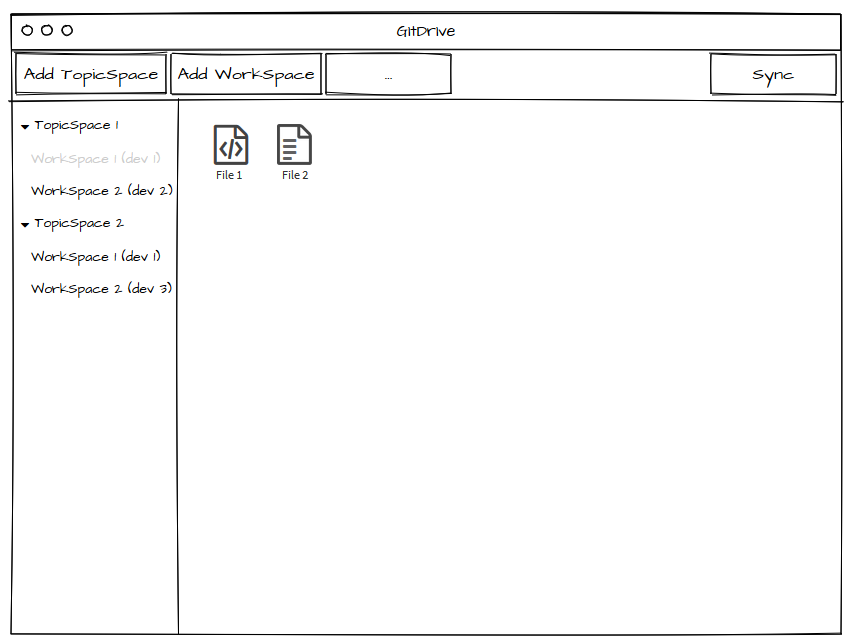

========
GitDrive
========
This is a high level documentation for GitDrive. This will detail the
intended use of the different parts in the project, along with any limitations,
issues, and missing parts/features.

Each section should be stand alone as much as possible. Meaning that no knowledge
of other sections is required to understand the functionality of a section.
That being said knowledge of the program's structure is helpful in understanding
the purpose behind the decisions that were made in designing the app.

==============
The Tech Stack
==============
Knowing the tech stack is helpful for understanding the structure. GitDrive is an Electron
app written in TypeScript. The Electron part means the app has two parts. The *main process*
and the *renderer process*.

The main process:
    Its what the app launches first, it's where the node run environment is and
    it's responsible for launching the renderer process/s. This is usually seen as the backend
    part where the logic is kept.

The renderer process:
    Contains Chromium along with access to the node environment APIs. This is what
    user interacts with and could consist of more than one window. Each window is a browser
    window that renders html, css, and javascript.

These two parts communicate on channels using something called ipcMain and ipcRenderer.
The ipc part stands for intra process communication. Each process is able to set listeners and send
messages on channels on its respective ipc object.

This should be enough for an overall idea, for a more in depth look, the Electron_ documentation
does a fantastic job. Also make sure to check awesome-electron_ for everything Electron related.

TypeScript is a structurally typed super set of javascript. This means that the app is transpiled
into javascript. It also means the code is type checked. This makes our code easier to refractor and
write with an IDE that supports TypeScript. It is recommended to look at the TypeScript handbook_
before diving into reading/writing any code.

The rest of the stack without build related dependencies is as follows:
    - Dugite_: A Typescript binder to Git's command line.
    - Mocha_: A test suite for javascript node applications.
    - Chai_: Chai is a BDD / TDD assertion library to be used in mocha tests.
    - Google-protobuf_: A language-neutral, platform-neutral mechanism for serializing structured data.
    - Vue_: A *progressive framework* for building responsive user interfaces. A bunch of vue related libraries are used as well.
    - Fs-extra_: Adds to the native node fs module methods and adds promise support to existing ones.

=============
The structure
=============
The application is a Model-View-Controller (MVC). The Model consists of the main Git commands that are
wrapped into the app commands. The app commands are listed in `The App`_. `The controller`_ part
consists of some state-hub logic integrated into the Vuex store then components. Then `the view`_
is specified per Vue component. This makes parts of the view (components) reuseable in whichever
context the user desires.

The file tree structure is explained below:

- **docs**: Is where this file resides, ie. the documentation.
- **build**: It is where the app gets transpiled.
- **src**: Where the app resides.
    + **components**: Where we keep the Vue components.
    + **examples**: A bunch of examples for how the code should be used.
    + **git-drive**: The logic for the app models is kept here.
        * **app**: The logic behind the main app commands: add-topicspace, ..., load-repo, start, ...
        * **controller**: Where the logic for the controller is kept.
        * **git**: The logic behind the core git commands is kept here.
    + **main**: The entry point for the main process, this is where webpack will look.
    + **model**: The model class objects abstraction is kept here.
        * **app**: The app classes/models.
        * **controller**: The controller classes/models.
        * **git**: The git classes/models.
    + **renderer**: The entry point for the renderer process/s, webpack will look here.
    + **store**: The Vuex store lies here, all the mutations, actions, and getters logic is here.
    + **tests**: The app tests, they are not transpiled like the rest of the dirs in src.
        * **app**: Tests for the app logic.
        * **controller**: Tests for the controller logic.
        * **git**: Tests for the core git commands.
        * **testRepos**: Toy repos for testing stuff on.
    + **util**: Utility functions that might be useful for any other parts in the app.
- **static**: Files that are used as is.
- **.electron-vue**: The webpack config and run scripts are here.
- **template**: Like static but its meant to be used by users not the app itself.

---------------------------

Notice how the *git-drive*, *model* and *tests* directories share the same structure.

The `protobuf`_ coupling/abstraction is specified within each model.

=================
The Build Process
=================

Our build process is not that involved but not trivial at the same time. Looking at the package.json_
scripts we notice 11 of them, most are not stand alone callable, here is the layout:

Dev-Build
---------
The start script is the one responsible this and has four steps. The first one is just cleaning the
build directory. The second step transpiles the app from TypeScript to javascript into the build
directory. The third runs the linter, based on the rules in tsconfig.json_. The fourth and last,
actually launches the app using webpack from the build/main and build/renderer directories

Production-Build
----------------
The dist (short for distribute) scripts are responsible for this. So far this is not functional.
I will finalize this and update the section accordingly.

App-Packaging
--------------
The pack scripts are responsible for this. So far this is not functional as well. Will update
the section once it is functional.

Testing
--------
The test script is the one responsible for this. The script runs any tests specified in the
src/test directory. The test assume the ts-node npm module to be installed globally as it is
responsible for transpiling the TypeScript tests in runtime thus it is not possible to run the
tests without it.

-----------------------------------

Notice how I did not go through any of the webpack setup or build configs. They are very standard
and self explaining to whoever knows anything about webpack. I know enough to make what is there now
work.

One thing worth mentioning is that none of the components are actually transpiled, they are compiled
in runtime using vue-loader and a bunch of other modules. This means when any of these are referenced,
ie. imported, they are referenced with respect to them existing in src/components directory not build/*
directory like the rest of the code.

===========
Terminology
===========
Below are formal definitions of each concept. Use this to help reason about and understand them.

**GRepository**
---------------
    Our own definition of a repository. It will consist of a group of one or more TopicSpaces.
    Each repository has a "Main" topicspace among maybe other ones. The repository has a name that
    cannot be longer than a 100 character. Also each user in the repository must have a unique
    name. Along with all the workspace branches, each repository has a metadata branch called "GH".
    For more information on how metadata is kept, read sectoin `How to do we keep metadata`_
    Finally, each repository can have none or only one remote repository linked to it. If it exists,
    the name of the remote repository is "origin".

**TopicSpace**
--------------
    A group of at least one or more WorkSpaces. Since each workspace can only have one user,
    the number of users has to match the number of workspaces. The name as well has to be less
    than a 100 characters. An in depth explanation of the structure of any topicspace can be found
    in the protobuf_ section.

**WorkSpace**
-------------
    A single branch for one user only. Meaning that only the user is allowed to commit on this branch.
    This way we can get who the user is by reading the tip's commit author information. The name of
    the branch starts with a capital "G" letter then the first 10 characters in the first
    commit's SHA. The "G" is added to avoid ambiguity in Git when referencing the branch ref and
    actual commit SHAs. This naming schema grants us unique names for quite a long time, a full proof
    way is to make the length of the SHA characters adapt to the total number of workspaces, maybe one
    day in the future. Choosing the first commit's SHA was deliberate as it offers us a quick way of
    reading the first commit's information and of referencing it along with the branch's tip when
    doing a ranged log to retrieve all the commits on the workspace for example.

**Sync**
---------
    For a user and a workspace, the operation does a commit followed by a push of the workspace then
    a fetch of all workspaces. This requires the branch checked-out to match the given workspace. It
    will also check that the given user owns the given workspace.

**Dispatcher**
--------------
    Where all the data-flow is handled along with events. It can control one or more app states. Any
    reads, writes to data should go through here. This will ensure the consistency of such operations
    and will make extending on them easier.

**App-State**
-------------
    A state that is tied to a browser window and app-data. The browser window coupling is not done
    yet. As for the app-data, this class is responsible for mutating the app-data state in a
    consistent way. This means creating a new object with every mutation since app-data is immutable.
    This class is also responsible for exposing any information from app-data. One might ask by now
    why not have app-data as a part of the Dispatcher instead of doing this. The reason is for the
    future where the app might have multiple windows in which dispatcher (or an api it will call) will
    be tasked with keeping information between them consistent.

**FS Explorer**
---------------
    The right bottom panel responsible for exploring the currently selected workspace. It will show
    directories/files and offer operations on them accordingly. These operations are tbd but one
    will be to show the history progression. This means show the linear line of commits that affected
    the directory or file in the selected workspace.

**Header Menu**
---------------
    Its the top panel where the app commands will reside. These commands will chang based on their
    context, ie. the current repository, current topicspace, and current workspace.

**TS Pane**
-----------
    Its the left panel where the user browses the current repository's topicspaces and workspaces.
    WorkSpaces are named based on their users.

**App Data**
------------
    The metadata that will be cached in between app sessions, such as current repository,
    current user, repositories, etc. This class is coupled with a protobuf message, thus this is
    how it will be written and read.

**Store**
---------
    The Vuex store, where the controller (dispatcher) meets the view. So the Vue component tree
    only allows for information to flow from parents to children using something they call props.
    This proves difficult if sibling components want to communicate information with each other.
    This problem can be solved by using a global data store as a single source of truth in which
    the entire component tree has access to the data in it using a defined set of interactions.
    These interactions are either getting the data, mutating the data, or doing an async action
    that might mutate the data eventually. By doing this our state transitions are clear to
    follow and thus debug.

==============
Common Errors
==============

============
The Git Core
============
This section assumes a certain level of comfort with Git commands, terminology and concepts.

The section will consist of the core Git commands that we wrap around with the help of dugite.
A lof of these are inspired or sometimes copied from the `GitHub Desktop`_ project, thanks
to them for that.

The list below will have commands that are exposed in multiple ways that depend on the
options given to the command. So in reality we have 37 Git commands/functions
exposed. If necessary, each command will also have an explanation of the purpose from including
it along with an explanation of why its exposed in such a way.

Also all the commands will not attempt to handle any error they encounter and will throw it
to the caller. The errors thrown follow the structure explained under core-git below.

Here are the commands in alphabetical order:

    **1.Add:**
        There is one function from the add command.

        1) *addAllToIndex(repo: Repository, addOptions?: IAddToIndexOtions)*:
        It stages everything in the working tree. All changes no matter what they
        will get staged. We do not expose partial staging (staging per file) since we have no
        use for it in our functionality. Partial staging is still achievable, if needed,
        using partial resets. A partial reset with the right option will effectively undo
        an add. The addOptions param is experimental, ie. not tested at all.
    **2.Branch:**
        We have two functions from the branch command.

        1) *createBranch(repo: Repository, name: string, tip: string)*: Creates a branch, which
        given a valid name with length less than a 101 characters and a committish tip will
        create a branch at the committish. HEAD has to be explicitly specified to avoid ambiguity.

        2) *renameBranch(repo: Repository, branch: Branch, newName: string)*: The second is
        renaming a branch, which given a branch and a new valid name
        will rename the branch to that name. We use rename while creating workspaces to rename
        temp branches after we create the first commit on them since we need the first 10
        SHAs characters from it.
    **3.Checkout:**
        We have four functions from the checkout command.

        1) *checkoutBranch(repo: Repository, branch: Branch | string)*: Just a
        normal checkout of a ref. Usually the ref will be a branch object,
        in fact this command is only used to checkout branches. The reason behind accepting
        a string is because of metadata branches. It turned out its a lot of headache to keep
        track of the metadata branch in a branch object so we only keep track of its ref name
        per repository and we used that name (string) to check it out when needed.

        2) *partialCheckout(repo: Repository, targetRef: string, paths: ReadonlyArray<string>)*:
        Our beloved partial checkout. Given a list of paths and ref, the command
        will checkout the state of those paths based on the ref into the current working tree.
        This operation should be run on an empty workspace.

        3) *orphanCheckout(repo: Repository, branchName: string, startPoint: string)*: An
        orphan checkout. Given a new branch name and a starting point, it will
        create an orphan branch based on the point. An orphan branch points to no commits,
        effectively breaking the history. This will be used when we create a new topicspace
        to ensure their independence. It is the caller's responsibility to create a commit on
        an orphan branch before checking out any other branch since an orphan branch with no
        commits gets discarded upon checking out anther branch.

        4) *checkoutAndCreateBranch(repo: Repository, branchName: string, startPoint: string)*:
        Create and checkout a branch. Given a branch name and a start point
        it creates a branch at that point and checks it out. This is just here to save us a
        shell-out call, its two birds with one stone.

    **4.Clone:**
        We have one function from the clone command.

        1) *clone(url: string, path: string)*: Your normal clone call. Given a valid url and a
        path, it will clone the url repository into that path.

        :Notice:
            There is a bit of work to be done on that command. We still
            need to figure out authentication. We disable the use of any default authentication
            handlers in order to implement ours. Will update the section once its done.

    **5.Commit:**
        We have one function from the commit command.

        1) *commit(repo: Repository, name: string, email: string, summary: string, message:
        string)*: A commit but with stuff baked in it. So given an author's name and email, a summary
        and a message, it will create a commit under HEAD with author and email set. Before
        committing, it will unstage everything then stage it all again.

    **6.core-git:**
        This is just a wrapper around the dugite exec command. The wrapper is meant to be used
        to extend on the error handling and result of dugite's api. The class GitError defines
        our errors in which each error having a human readable description of the error,
        the errored command's arguments, the error enum from dugite/errors.ts, and the
        actual text of the error. An error is triggered whenever the process returns with a none
        zero exit code. The wrapper does not attempt to handle any errors, its all left to the
        caller.

    **7.Diff-index:**
        We have one function from the command. The code for this was taken from the
        `GitHub Desktop`_ project.

        1) *getIndexChanges(repository: Repository)*: As the name suggests, the command will
        return a list of of files who have changes in the indexing when compared against HEAD.

    **8.Diff:**
        We have five functions from the diff command. The code for this was take from the
        `GitHub Desktop`_ project.

        1) *getCommitDiff(repository: Repository, file: FileChange, commitish: string)*:
        Gets a commit's diff. Given a file and a commitish, it will return
        the diff of the file between the commit and the commit's parent. This could be used to
        check if a commit introduces a change to a file. This command is actually an exception in
        the fact that it uses log instead of the diff command, it returns a diff though and thats
        what matters.

        2) *getWorkingDirectoryDiff(repository: Repository, file: WorkingDirectoryFileChange)*:
        Gets a diff between a file and the working tree. Given a file, the
        command renders the diff for a file within the repository working tree. The file
        will be compared against HEAD if it's tracked, if not it'll be compared to an empty
        file meaning that all content in the file will be treated as additions.

        3) *getImageDiff(repository: Repository, file: FileChange, commitish: string)*:
        Gets an image diff. This is not going to be used for now, it is there
        since I didn't write this code.

        4) *convertDiff(repository: Repository, file: FileChange, diff: IRawDiff, commitish:
        string, lineEndingsChange?: LineEndingsChange)*:
        This is a utility function that converts rawDiff or changes to an IDiff object. This
        is implementation specific, its exported since it might be useful given the type of diff
        a user posses. Explaining the command is tedious and not necessary.

        5) *getBlobImage(repository: Repository, path: string, commitish: string)*:
        Gets a binary blob of an image. Again for now this is not used.

    **9.Fetch:**
        There are two functions from the fetch command.

        1) *fetchAll(repo: Repository)*:
        Just a fetch of all the refs in a repository. Given that our repositories will
        only have one remote branch called origin then we fetch all the refs from it. Notice how the
        command does not check whether the remote repository exist in the given repository. This
        check if left for the caller to do as it might become redundant.

        2) *fetchRefspece(repo: Repository, refspec: string)*:
        Fetches a specific ref. Given the name of the ref the function will fetch
        it down. Again this does fetch from origin and does not check whether the remote repository
        exists. This also does not check the existence of the given ref.

        :Notice:
            The authentication is not implemented for this as well, in fact it is not
            implemented for any network related command.

    **10.For-each-ref:**
        There is one function from this command.

        3) *getBranches(repository: Repository, ...prefixes: string[])*:
        A getter for refs in the repository based on a namespace. So given a namespace, the
        command will return an array with all the refs under the namespace. For example, giving
        the command refs/heads will return all the local branches. Another example is giving the
        command remotes/origin will return all the remote refs from remote repository origin. Call
        the function with just a repository to get all the refs.

    **11.Init:**
        There is one function from this command.

        1) *init(pathToRep: string)*:
        Just an init of a repo given a path that exists. Notice that the function does not
        check if the path exists, this is left for the caller.

    **12.Log:**
        There are three functions from this command. This code was taken from the `GitHub Desktop`_
        project.

        1) *getCommits(repository: Repository, revisionRange: string, limit: number,
        additionalArgs: ReadonlyArray<string> = [])*:
        A getter for commits. Given a revision range (a git defined concept), and a
        limit, the command will return an array of the commits that fall within the range.

        2) *getChangedFiles(repository: Repository, sha: string)*:
        Gets the changed files per commit. Given a commitish, the command will
        return an array the files that were changed by the commit.

        3) *getCommit(repository: Repository, ref: string)*:
        Retrieves a single commit based on a ref. Given a ref, the command will return
        the commit the ref is pointing to or null if the ref doesn't point to a commit.

    **13.Pull:**
        There is one function from the pull command.

        1) *pull(repo: Repository)*:
        Just a normal pull of the current HEAD. This should not be used and is there only for the
        possibility of needing it. The main problem is that users can make commits through GitHub,
        commits that won't follow our rules and we have to deal with it. We will see. We maybe able to
        tolerate the owner of the branch rebasing some remote commits made on their own branch.

        :Notice:
            Authentication is not implemented.

    **14.Push:**
        Similar to fetch, there are two functions from the push command.

        1) *pushBranch(repo: Repository, localBranch: string)*:
        Just a push of a branch. Given a branch name, the command will push it to its
        tracked upstream branch, origin in our case.

        2) *pushAll(repo: Repository)*:
        A push of all refs. Again this will push to origin.

        :Notice:
            None of these commands checks if origin is setup, this is left to the caller.
            Also authentication is not implemented.

    **15.Remote:**
        There are three functions from the remote command.

        1) *getRemote(repo: Repository)*:
        A getter for a remote. Given a repository, the command will return the one and
        only remote as an IRemote object, the object will contain the name and url.

        2) *addRemote(repo: Repository, url: string)*:
        Adds origin. Given a url, the command will add origin with the url into the
        remote repositories configs.

        3) *changeUrl(repo: Repository, newUrl: string)*:
        Changes the remote repository. Given a new url, the command will change the
        url of origin to the url given.

    **16.Reset:**
        There are three funcitons from the reset command.

        1) *reset(repo: Repository, targetRef: string, mode: ResetMode)*:
        A ref based reset. Given a ref and a reset mode, the command will reset the
        current working tree to that ref based on the mode given.

        2) *restPath(repo: Repository, targetRef: string, mode: ResetMode,
        paths: ReadonlyArray<string>)*:
        A path based reset. Given a ref, a mode and a list of paths, the command will
        reset the current working tree's paths to the state in the ref based on the mode.

        3) *slicePathsReset(repo: Repository, firstArgs: string[], paths: ReadonlyArray<string>)*:
        A HEAD based reset. When called on a repo, the command will effectively
        un-stage all the changes in the current working tree.

        :Notice:
            Given the ResetMode enum, there are only two reset modes possible to use,
            soft and mixed resets. Hard resets are not possible.

    **17.Rev-parse:**
        There are two functions from the rev-parse command.

        1) *getTopLevelWorkingDirectory(path: string)*:
        A getter for the top level path of a repository. Given a path, the function
        will return the top level absolute path of that git repository or null if it isn't a
        git repository.

        2) *isGitRepository(path: string)*:
        Verifies whether the path is a root of a git repository. Given a path, the
        function will use the one above to return whether the path is the root path in a
        repository or it isn't. This is used to determine whether we can start a repository
        at a path or not, because if its already a repository we cannot. The fact that we
        only care about the root path is because we want the user to be able to nest their
        repositories within each other. Nesting repositories is easy as long as the
        .gitignore files are updated correctly.

    **18.Show:**
        There are two closely related functions from the show command.

        1) *getBlobBinaryContents(repo: Repository, commitish: string, filePath: string)*:
        Gets the binary blob content of a file based on a commit. Given a commitish,
        and a path, the function will return a buffer that contains the contents of the file
        based on the commitish. This function is super helpful when reading from the metadata
        branch for example. Using it we are able to read the metadata protobuf file without
        having to checkout the branch.

        2) *getPartialBlobBinary(repo: Repository, commitish: string, filePath: string,
        length: number)*:
        Just like the first except that it takes a length argument. The length
        represents the maximum amount of bytes to be read from the file. This is helpful if
        its anticipated the file is going to be too big.

    **19.Statues:**
        There is one function from the statue command. This code was taken from the
        `GitHub Desktop`_ project.

        1) *getStatus(repository: Repository)*:
        Getter for the current working tree status based from the top level of the
        repository. When run on a repository the command will return an IStatusResult object
        that contains: The name of the current branch, the current upstream branch
        (if it exists), the current tip commit's SHA, whether the branch is ahead or
        behind its upstream, if the repository exists, and lastly a WorkingDirectoryStatus
        object that has a list of WorkingDirectroyFileChanges of the current files to be
        staged in the current working tree.

        :Notice:
            There is no explicit notion of partial staging, the way to do it is to give
            the WorkingDirectoryStatus class (in model/status.ts) a selected list of
            WorkingDirectroyFileChanges.

            Also the command will not have any relative paths for the files it returns
            since it is run from the top level of the repository. The status command's
            output changes based on the current *working directory*.

======
Models
======

========
Protobuf
========
So we use `Google's protobuf`_ to serialize our our metadata and store it. Our protobuf files are
in the `static/proto-models`_ directory. The directory includes proto3 definitions of each model
in the src/model directory and javascript generated code.

The rules for protobuf messages generated code change per language. This page_ has all the
information needed for javascript. One thing to keep in mind is if a message field is not
available then its undefined by default. The command bellow is run from the proto-models
directory to generate the javascript code from the proto files.
::

    rm *.js && ../protoc/bin/protoc.exe --proto_path=./ --js_out=import_style=commonjs,binary:./ committerid.proto
    commit.proto user.proto branch.proto repo.proto topicspace.proto workspace.proto grepo.proto app-data.proto

Given the generated code above, each class in the model directory uses its generated code to
create the messages under the hood. What under the hood means is each class has only one
public member which is the proto message object. Using the proto message object, each class has
a set of getters to expose its members. The proto message object is always initialized in the
constructor, and has its proto message fields set in the constructor as well. The getters use
the proto message object to retrieve the fields, convert them into objects from messages if
needed, then return them to the user.

:Notice:
    This conversion into object from proto message results in the following weirdish behavior:
    The memory address of an object passed to a constructor is not the same as the one retrieved
    from a getter. Its the same object in terms of content. So for example if we pass
    committerID object with address x to the Commit constructor then try and retrieve it later,
    we will get a new committerID object with address y. They will have the same content exactly
    even though they are two different addresses underneath. They also have the same exact
    protobuf object, in content and address.

    Conclusion, two object are equal iff their content is equal or their protobuf objects are
    the same.

Each proto message object has this naming scheme "[className]ProtoBuf", with a lowercase class
name.

Along with the above, each model class has two more public methods.

The first is a static class method to deserialize protobuf messages. For this to work, each
constructor is overloaded to accept *just* a protobuf message. This way we can initialize a
class using just the protoBuf message by setting the protobuf message object to the given proto
message. And given the way the getters are made, all the members will be read from the message
without us needing to read them out to set them in the constructor.

The second method is a none static public serialize method. This will return the serialized
binary array of the proto message object for it to be sent over the wire or stored on disk.

How to do we keep metadata
---------------------------

For each GRepository, the metadata will be saved in a "repo.proto" file at the root of the
repository. The file will include a serialized GRepository object.

As discussed in the definitions, each GRepository has a metadata branch called "GH". The reason
behind choosing GH is to break the workspace_ naming convention while being as short as possible.
The main purpose of the metadata branch is to keep track of the structure changes in the repository.
This means, keep track of the additions or removals of topicspaces or workspaces. This is not
possible to do by just recording the metadata upon each commit like we already do. This is the case
because of the following example:

    :Disclaimer:
        The following example is not representative of how the protobuf data is stored, its
        simplified. Read the rest of the section for the full picture.

    Let's say we have three users working on a topicspace and the commit graph looks like this::

             __[2]--[3]
            /
        [1]-- --[4]
            \
             --[5]--[6]--[7]              Each [x] represents a commit.

    For the sake of simplicity let's assume that all the users are aware of each other's existence,
    meaning that reading the "repo.proto" file from any commit on any workspace, ie. commits
    {2,3,4,5,6,7}, will result in a deserialized object that has one topicspace with three workspaces.

    Now lets say we have a fourth user who joins the topicspace as such::

             __[2]--[3]
            /
        [1]-- --[4]
            \
             --[5]--[6]--[7]
                \
                 --[8]                     Each [x] represents a commit.

    Since we save the protobuf file with each commit, only commit [8] is aware of the existence of
    the new workspace. Its simple for other users to become aware of the addition, since
    they will each get a new branch once they sync with the remote repository.

    The problem resides when this repository is cloned at this state. Unless the cloning algorithm
    reads every "repo.proto" file from each workspace in the repository it might not know about the
    last workspace existence.

    The problem is solved by having a single source of truth for reading the structure of the
    repository, the metadata branch "GH". As you might have guessed by now, having one branch
    with multiple people committing on it means we will be dealing with merge conflicts. This is
    true but sort of trivial. Comparing the different metadata files with removals taking precedent
    should result in the most up to date file. The algorithm for this is yet to be implemented since
    we don't have a merge command. I will update the section once its done.

The metadata branch is only written to after running these commands: startRepo, createTopicSpace, and
createWorkSpace.

So I sort of lied in the last example. There is yet another problem when saving metadata upon committing.
The metadata has no way of recording the full metadata about the commit its read from. The example below
explains why:

    ::

        [1]--[2]

    Let's assume our metadata keeps track of the commits in the history above. This information
    would look something like the SHA of the commit, author, data, time, summary, and message.
    Most of this information is not available before making the actual commit.

    Meaning if the metadata file was written to disk before committing [1], it will only have
    info about the author, summary and message. This metadata is incomplete. Commit [2] works
    similarly except that it has full information about commit [1].

As the example above showed, the metadata about the commit to be made is incomplete. This is why
I chose not to save the any metadata about the commit that's about to be made. This means:

    (1) Any repo.proto file state with regards to commits on workspaces is *at least* one commit
    behind when compared to where the actual ref (branch) points.

The at least part is for the fact that other users could have made several commits on their
workspaces that the current repo.proto file has no information about. So:

    (2) A repo.proto file read from a workspace is *exactly* one behind the ref (branch) pointer
    for that workspace.

All this is a headache to deal with when it comes to creating a topicspace. This is why:

    ::

             __[2]
            /
        [1]-- --[3]
            \
             --[4]                           Each [x] represents a commit.

    Here we have commit [1] as the initial state, it can be retrieved by reading the firstCommit
    property of the topicspace class. Given all the above, commit [2] metadata has knowledge of
    commit [1] only. Commit [3]'s metadata has knowledge of commit [1] and [2] only. And so on.

    Since we don't keep partial metadata, we don't write any "repo.proto" files in the first commits
    of workspaces that were created using startRepo. The main reason is that throughout the execution
    of startRepo, we don't have a GRepository object to serialize until the end of the method.
    This is not the case for any workspace created using createWorkSpace. It is inconsistent but
    its kept since the distinguishing information might be useful down the line.

    There is another reason why metadata should not be read from first commits on workspaces, its
    left for the reader to reason about. Hint: it has to do with adding topicspaces.

Speaking of startRepo, we have another exception to a rule. The committer and author of a commit
should match with, maybe, the exception of the first commit in a workspace. This happens when a user
specifies the users for a topicspace they are about to create. Since the author of a commit can be
set manually, we do set it accordingly for each user and their workspace. But we cannot set the
committer field, thus the exception. This should have no effect on how the app operates since we
rely on the author field to verify things. This is only problematic if someone tries to maliciously
introduce commits that we believe are valid. This is fixable with enforcing GPG signing of commits.

The exception is also fixable if we find a way of communicating an invite to a topicspace,
that way only when a user accepts the invite they will create their workspace. This will happen
down the line, for now it is not necessary.

Finally, we also keep track of the current user in a file called ".CURRENT_USER" located at the root
of the repository. The reason behind this file's existence is mainly to introduce a change in
between workspaces when they are created. If we have no changes we cannot commit. The file just
includes the user's name and nothing else.

=======
The App
=======

StartRepo
---------
Creates a repository in the given path with the given users. Meaning that each user will have a
workspace in the default "Main" topicspace. A path is valid if it exists and has no repository
initialized in it. The method also copies the default .gitignore file from the static directory.

The method returns the new repository.

The "GH" branch will be checked-out at the end of the method's execution.

CreateTopicSpace
-----------------
Creates a topicspace with the given users based on a commit. The new topicspace will be an orphan
checkout based on the given commit's state.

The method returns a pair of objects, the first is the repository with the new topicspace added
to it, and the second is the topicspace created.

The "GH" branch will be checked-out at the end of the method's execution.

CreateWorkSpace
----------------
Creates a workspace in the given topicspace based on a workspace. The new workspace being based on
the latest state of another workspace is for simplicity. In fact, I will also add the ability to
base the new workspace on the initial state of the topicspace or just an empty state.

The method returns a pair of objects, the first is the repository with the new workspace added to
it, and the second is the workspace created.

The "GH" branch will be checked-out at the end of the method's execution.

download
---------
Downloads the repo. To be implemented.

loadGRepo
----------
Given a path, checks whether it adheres to our rules then reads it out, if it doesn't it will
error out. Even though its tedious to check for all the rules, this method doesn't take long
to execute.

partialCheckouts
-----------------
Partially checkout a file or a directory along with its sub-directories or not.

Sync
----
Writes the repository state to memory then commits in the given workspace for the given user,
with the given commit summary and message. This method does the necessary checks to ensure
only the user who owns the workspace is committing in it. This method will also push the changes
and fetch the rest of the branches if the remote repository exists. Handling the new changes
from pulled branches is yet to be implemented.

==============
The Controller
==============

========
The View
========

======
Limits
======

==========
Git Errors
==========

.. _Electron: https://electronjs.org/docs
.. _awesome-electron: https://github.com/sindresorhus/awesome-electron
.. _handbook: https://www.typescriptlang.org/docs/handbook/basic-types.html
.. _dugite: https://github.com/desktop/dugite
.. _mocha: https://mochajs.org/
.. _chai: http://www.chaijs.com/
.. _google-protobuf: https://developers.google.com/protocol-buffers/
.. _vue: https://vuejs.org
.. _fs-extra: https://github.com/jprichardson/node-fs-extra
.. _package.json: ../package.json
.. _tsconfig.json: ../tsconfig.json
.. _GitHub Desktop: https://github.com/desktop/desktop
.. _page: https://developers.google.com/protocol-buffers/docs/reference/javascript-generated
.. _`Google's protobuf`: https://developers.google.com/protocol-buffers/
.. _`static/proto-models`: ../static/proto-models
